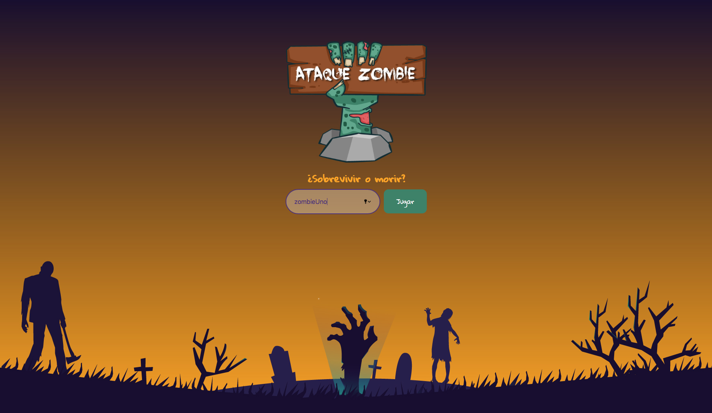
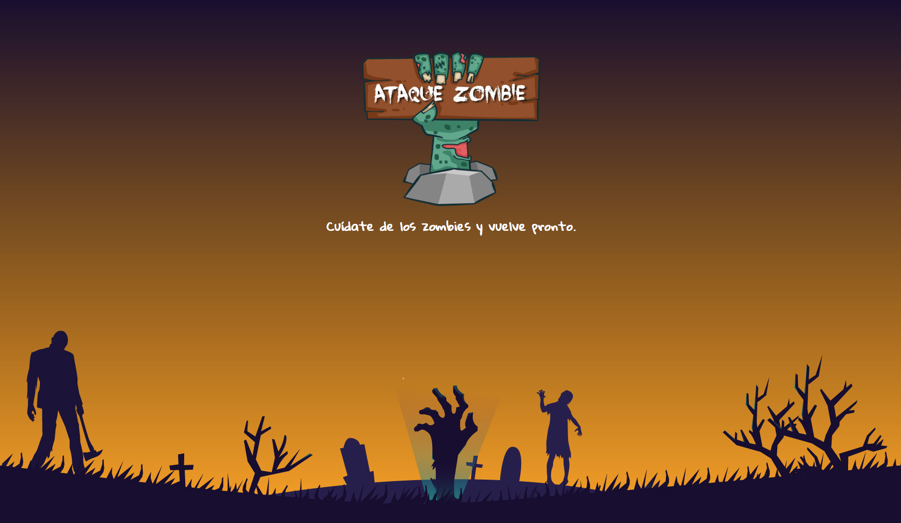

# ATAQUE ZOMBIE

Proyecto de preadmisión para el ingreso a Laboratoria. Realizado por Dulce Mercado y Ana Rátiva.

## Índice

* [1. Descripción del proyecto](#1-descripción-del-proyecto)
* [2. Interfaz del usuario](#2-interfaz-del-usuario)
* [3. Prototipado](#3-prototipado)

***

## 1. Descripción del proyecto

ATAQUE ZOMBIE permite que el usuario identifique cuál es su probabilidad de supervivencia ante un ataque zombie. Evalua las acciones que él realiza para mantenerse con vida y las armas que utilizaría para defenderse.

### Construído con
1. Html
2. Css
3. Vanilla JavaScrip

## 2. Interfaz del usuario

1. Mostrar una pantalla de bienvenida, pida tu nombre para comenzar a jugar.
2. Mostrar un mensaje de Hola [tu nombre] y dos botones para comenzar a jugar.
    * Jugar con preguntas de tipo A (Acciones de supervivencia)
    * Jugar con preguntas de tipo B (Armas de defensa)
3. Lanzar la pregunta 1 con alternativas, el usuario responde, luego se muestra la pregunta 2 y luego la 3.
4. Mostrar una pantalla de resultados (respuestas correctas o incorrectas) y dos botones:
    * Volver a jugar
    * Salir

## 3. Prototipado
